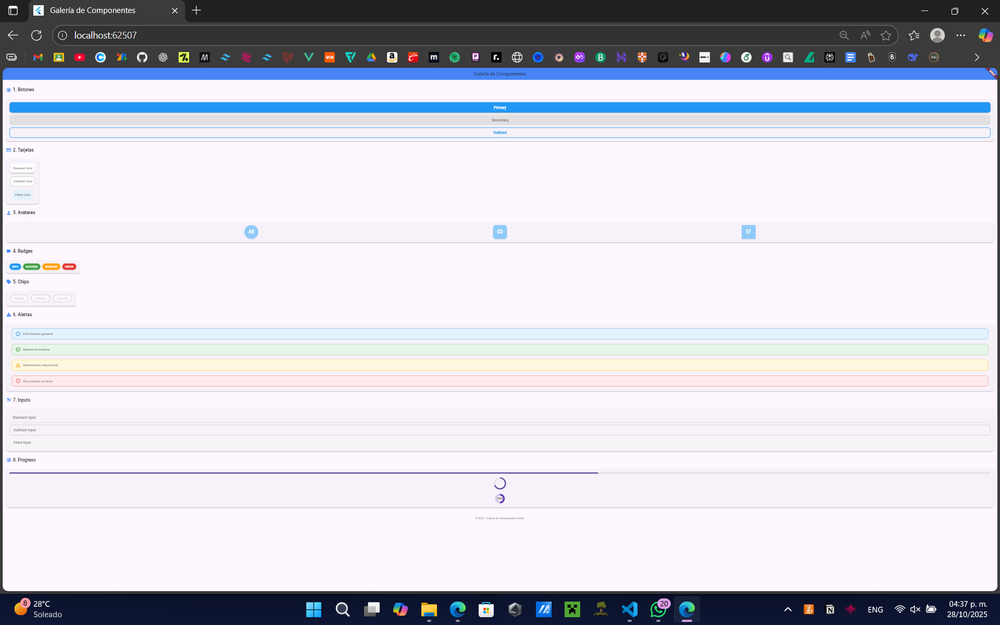
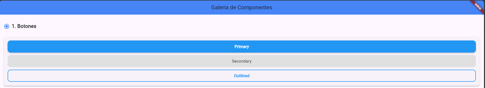
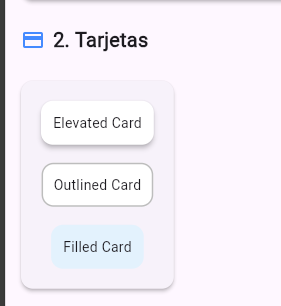
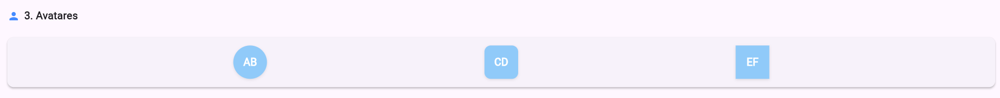
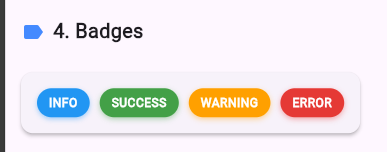
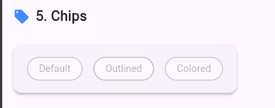
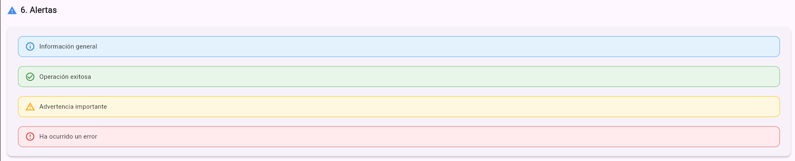
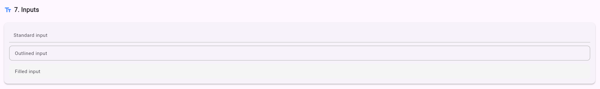
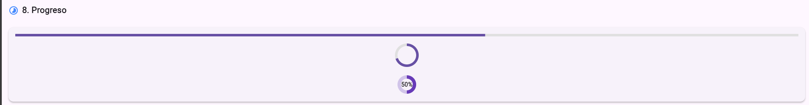

# Component Gallery

**Nombre:** Carlos Galán Hernández  
**Matrícula:** [I20223TN124]

---

## Descripción del proyecto
**Component Gallery** es una aplicación Flutter que funciona como **galería de componentes personalizados**.  
Permite mostrar, probar y aprender sobre diferentes widgets con variantes visuales como botones, tarjetas, switches y más.  
El proyecto está pensado para servir como **referencia de UI/UX** y práctica en desarrollo Flutter.

---

## Componentes implementados
1. **CustomButton** – Botón personalizado con variantes de estilo.  
2. **CustomCard** – Tarjetas con bordes y colores distintos.  
3. **CustomTextField** – Campos de texto con iconos y validación.  
4. **CustomSwitch** – Switches con estilo propio.  
5. **CustomCheckbox** – Casillas de verificación personalizadas.  
6. **CustomSlider** – Slider con rangos y colores personalizados.  
7. **CustomAppBar** – Barra de navegación superior estilizada.  
8. **CustomBottomNavigationBar** – Barra inferior de navegación con íconos y etiquetas.

---

## Tabla de componentes y variantes

| Componente               | Variantes                       |
|---------------------------|---------------------------------|
| CustomButton             | Elevated, Outlined, Filled      |
| CustomCard               | Elevated, Outlined, Filled      |
| CustomTextField          | Normal, WithIcon, Password      |
| CustomSwitch             | On/Off                          |
| CustomCheckbox           | Checked/Unchecked               |
| CustomSlider             | Default, Range                  |
| CustomAppBar             | Transparent, Colored            |
| CustomBottomNavigationBar| Default, WithLabels             |

---

## Screenshots

1. **Pantalla Principal**  
   

2. **Botones**  
   

3. **Tarjetas**  
   
4. **Avatares**  
   

5. **Badges**  
   

6. **Chips**  
   

7. **Alertas**  
   

8. **Inputs**  
   

9. **Progeso**  
   

---

## Uso

### Requisitos
- Flutter SDK (versión recomendada: 3.13.0)  
- Emulador Android/iOS o dispositivo físico  

### Ejecución
1. Clonar el repositorio:
   git clone [https://github.com/Carlos-GH23/galeria_componentes_cgh.git]
2.Entrar a la carpeta del proyecto:
  cd component_gallery
3. Instalar dependencias:
  flutter pub get
4. Ejecutar la app en un emulador o dispositivo:
  flutter run
